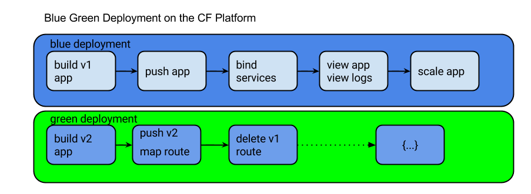

= Dev Ops Experience

== Goals

To deploy and configure a microservice and UI, leverage the platform for monitoring & management of the microservice, and automate a continuous delivery pipeline.

== Pre-work

1. Fork link:https://github.com/pcf-alliances-immersion/pcf-immersion-workspace/[`PCF Workspace`]  project
2. Review the link:https://github.com/pcf-alliances-immersion/pcf-immersion-workspace/tree/master/cities[overview] of the `cities` repository.  
3. Review the documentation on link:http://docs.pivotal.io/pivotalcf/devguide/deploy-apps/prepare-to-deploy.html[Considerations for Designing and Running an Application in the Cloud]
4. Review the documentation on link:http://docs.pivotal.io/pivotalcf/devguide/deploy-apps/streaming-logs.html#writing[Writing to logs]

== Steps
In this workshop we are going to follow these steps to deploy apps on Cloud foundry and manage the lifecycle

** Building app
To build the app go to the workspace folder
[source,perl]
cd pcf-workspace/cities
gradle build

** Pushing apps
1. Start with the cities-service app
[source,perl]
cd pcf-workspace/cities/cities-service/build
cf target
cf libs/cities-service-0.0.1-SNAPSHOT.jar

2. Next, push the cities-ui app

** Using Manifests
Create Manifest files to push the app

** Dependency Injection in Spring
Bind to in memory database

** Health, logging & events via the CLI

View recent logs using CLI

** Binding to services
Bind Cities Services to MySQL
Bind Cities UI to Cities Services

** Environment variables
View the environment variable and explantion of VCAP

** Scaling apps
Scale the App using Ops Manager

** Verify the app from the Console

** Create Version 2
Create Version 2 by changing the Version Number Env variable 

** Push Version 2 and Delete the Old Route using the script

** Verify the app, zero downtime
