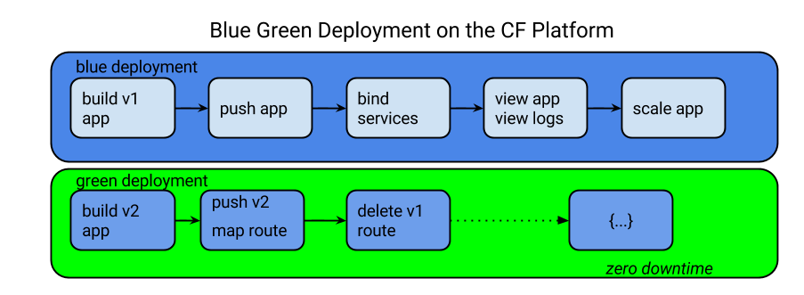

= Dev Ops Experience

== Goals

To deploy and configure a microservice and UI, leverage the platform for monitoring & management of the microservice, and automate a continuous delivery pipeline.

== Pre-work

1. Fork link:https://github.com/pcf-alliances-immersion/pcf-immersion-workspace/[`PCF Workspace`]  project
2. Review the link:https://github.com/pcf-alliances-immersion/pcf-immersion-workspace/tree/master/cities[overview] of the `cities` repository.  
3. Review the documentation on link:http://docs.pivotal.io/pivotalcf/devguide/deploy-apps/prepare-to-deploy.html[Considerations for Designing and Running an Application in the Cloud]
4. Review the documentation on link:http://docs.pivotal.io/pivotalcf/devguide/deploy-apps/streaming-logs.html#writing[Writing to logs]

== Steps
In this workshop we are going to follow these steps to deploy apps on Cloud foundry and manage the lifecycle

** Building app
To build the app go to the workspace folder
`` cd pcf-workspace ``
** Pushing apps
** Using Manifests
** Dependency Injection in Spring
** Health, logging & events via the CLI
** Binding to services
** Environment variables
** Scaling apps

The following exercises should be completed for your `cities-service`, not the `cities-ui`.

* link:user-console.adoc[User Console]

* link:ide-integration.adoc[IDE integration]

* link:app-log-drain.adoc[Application Log Draining]

* link:apm.adoc[Monitoring with APM tools]

* link:remote-debugging.adoc[Remote debugging]

* link:app-autoscaling.adoc[Application Autoscaling]

* link:../continuous-delivery/README.adoc[Continuous Delivery]
